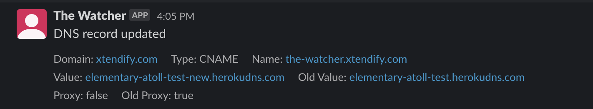

# The Watcher Slackbot
Get CloudFlare audit logs directly to your Slack Workspace.

## Installation
1. Install to your Slack Workspace by going to [https://the-watcher.xtendify.com/](https://the-watcher.xtendify.com/).
2. Add the bot to Slack channel where you want to recieve log notifications.
3. Run the command `/cloudflarewatcher <org_id> <email> <api_key>`.
4. That's it! You will start getting logs directly to your channel.

## Development
1. Copy `.env.example` to `.env` and populate the variables.
2. Run `yarn` and `yarn dev` to run the app.
3. To test cron, run http://localhost:3000/cron.
